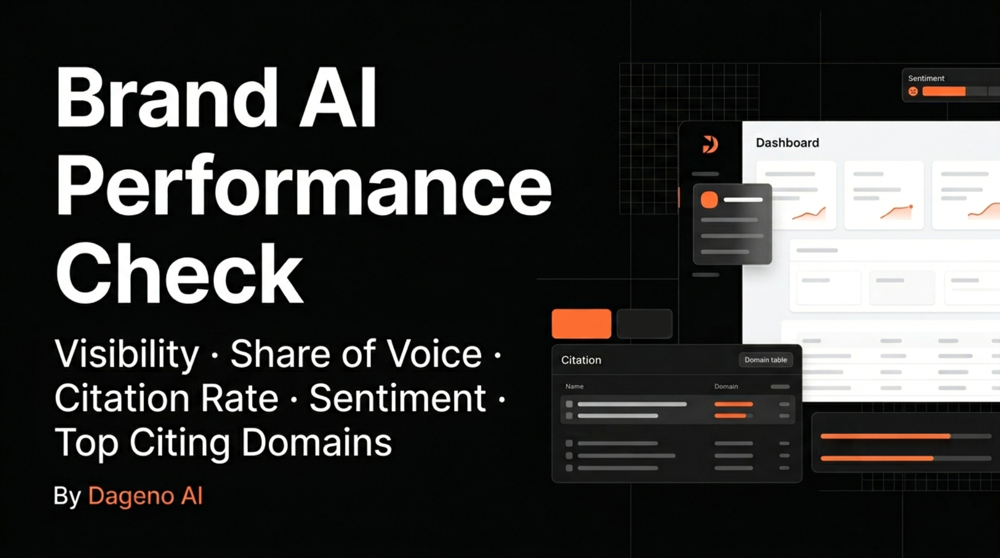
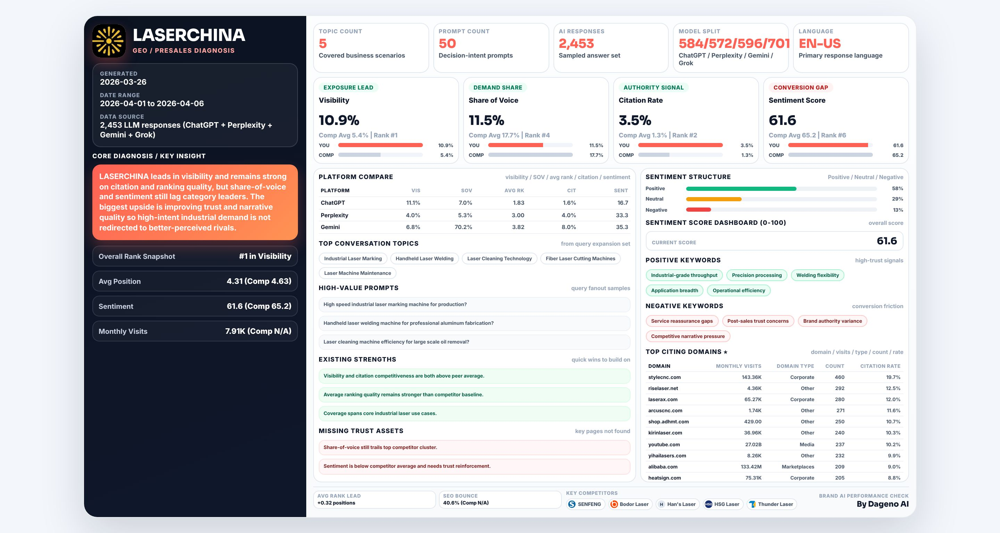
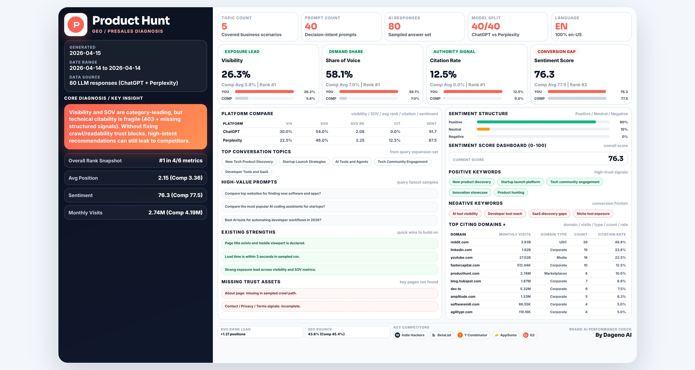
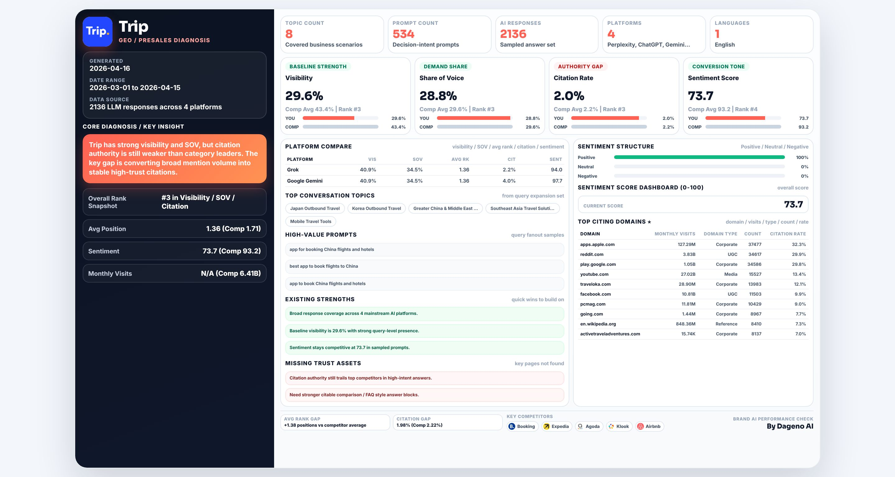
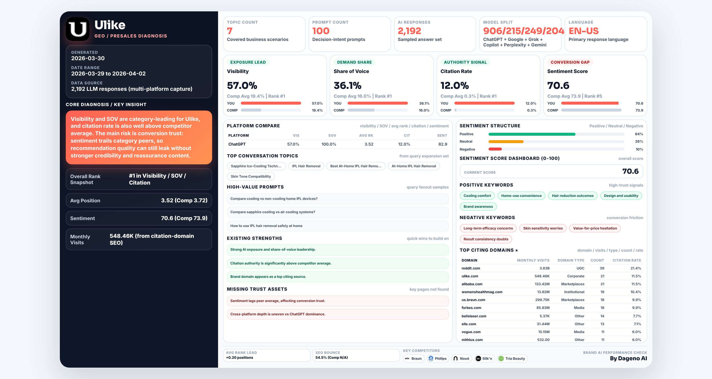
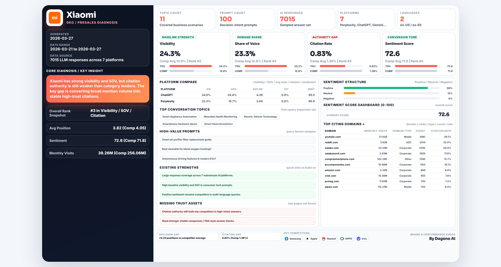
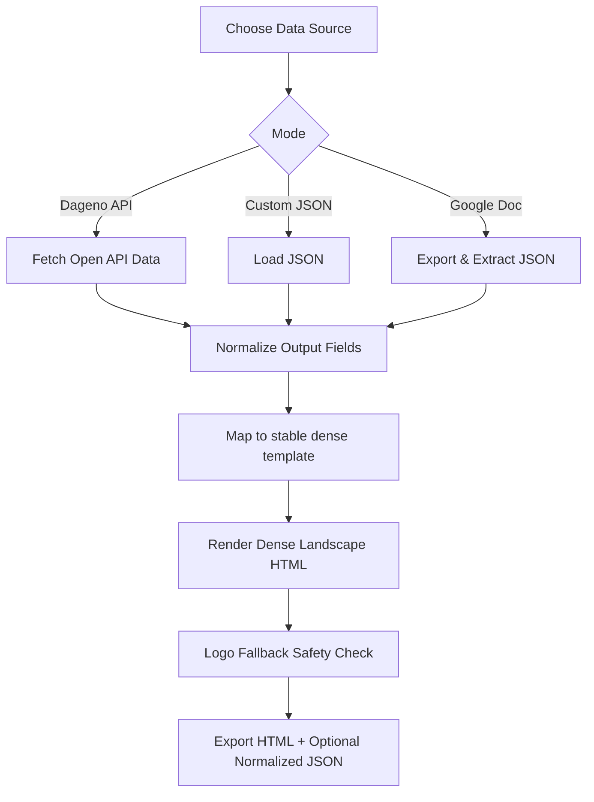

<!-- DAGENO_AGENT_NAV_START -->

**Dageno Agent Project Map / Dageno Agent 项目导航**

If this repo is useful, you may also want the adjacent Dageno Agent projects for GEO, SEO, AI visibility, and content operations.
如果这个仓库对你有帮助，也可以看看这些相邻的 Dageno Agent 项目，用于 GEO、SEO、AI 可见性和内容增长工作流。

| Stage / 阶段 | Project / 项目 | Use it for / 用途 |
| --- | --- | --- |
| Diagnose / 诊断 | [seo-geo-audit](https://github.com/dageno-agents/seo-geo-audit) | SEO + GEO audit workflows for brands and agencies / 面向品牌和服务商的 SEO + GEO 诊断工作流 |
| Topic + prompt generation / Topic + Prompt 生成 | [dageno-online-topic-prompt-generator](https://github.com/dageno-agents/dageno-online-topic-prompt-generator) | Generate Dageno-ready Topic clusters and high-intent monitoring prompts from a real domain / 基于真实网站生成可导入 Dageno 的 Topic 集群和高意图监控 Prompt |
| Content workflows / 内容生产 | [seo-geo-content-engine](https://github.com/dageno-agents/seo-geo-content-engine) | Full SEO/GEO content workflows / 完整 SEO/GEO 内容工作流 |
| Fanout writing / Fanout 写作 | [geo-content-writer](https://github.com/dageno-agents/geo-content-writer) | Turn Dageno fanout into briefs, drafts, and review contracts / 把 Dageno fanout 变成 brief、draft 和 review contract |
| Organic intelligence / 自然增长分析 | [organic-content-intelligence](https://github.com/dageno-agents/organic-content-intelligence) | Search demand, page funnels, intent coverage, and GEO visibility / 搜索需求、页面漏斗、意图覆盖和 GEO 可见性分析 |
| Site architecture / 站点架构 | [geo-site-architecture-audit](https://github.com/dageno-agents/geo-site-architecture-audit) | Audit site structure and turn it into GEO-ready content recommendations / 诊断网站结构并输出 GEO 内容与内链建议 |
| Brand AI performance / 品牌 AI 表现 | [brand-ai-performance-check](https://github.com/dageno-agents/brand-ai-performance-check) | Dense brand diagnostic reports from Dageno API or custom input / 基于 Dageno API 或自定义数据生成品牌 AI 诊断报告 |
| Automation / 自动化 | [n8n-nodes-dageno](https://github.com/dageno-agents/n8n-nodes-dageno) | Dageno API node for n8n automation / 用于 n8n 自动化的 Dageno API 节点 |
| API + MCP playbook / API 与 MCP | [dageno-mcp-growth-playbook](https://github.com/dageno-agents/dageno-mcp-growth-playbook) | GEO reporting, prompt gaps, citation intelligence, and growth execution / GEO 报告、Prompt Gap、引用分析和增长执行手册 |

More projects / 更多项目: [geo-visual-content-engine](https://github.com/dageno-agents/geo-visual-content-engine), [seo-outreach-skill](https://github.com/dageno-agents/seo-outreach-skill), [geo-pre-sale-report-private](https://github.com/dageno-agents/geo-pre-sale-report-private), [GEO-SEO](https://github.com/dageno-agents/GEO-SEO).

Explore all repos / 查看全部项目: [github.com/dageno-agents](https://github.com/dageno-agents) · Product / 产品: [Dageno](https://dageno.ai/?utm_source=github&utm_medium=social&utm_campaign=official)

<!-- DAGENO_AGENT_NAV_END -->

# Brand AI Performance Check



Stable, data-dense, single-visual **English HTML** reporting skill for GEO brand diagnostics.

## Why this repo

- Fixed high-quality dense template (stable dense template style)
- API-first data mapping from Dageno Open API
- Custom data mode via JSON or public Google Doc
- Showcase-ready assets for portfolio/demo

## Case Showcase

| Product | Visual | HTML Sample |
|---|---|---|
| LaserChina |  | [LaserChina.html](examples/showcase/html/LaserChina.html) |
| Producthunt |  | [Producthunt.html](examples/showcase/html/Producthunt.html) |
| Trip |  | [Trip.html](examples/showcase/html/Trip.html) |
| Ulike |  | [Ulike.html](examples/showcase/html/Ulike.html) |
| Xiaomi |  | [Xiaomi.html](examples/showcase/html/Xiaomi.html) |
| eSignGlobal |  | [eSignGlobal.html](examples/showcase/html/eSignGlobal.html) |

## Logic Flow



## Directory Structure

```text
.
├── README.md
├── docs/
│   ├── WORKFLOW.md
│   ├── OUTPUT_SCHEMA.md
│   └── TEMPLATE_RULES.md
├── skill/
│   ├── SKILL.md
│   ├── agents/openai.yaml
│   ├── references/required-fields.md
│   └── scripts/generate_report.py
└── examples/
    ├── custom_input.sample.json
    ├── output/
    └── showcase/
        ├── cover.jpg
        ├── images/
        └── html/
```

## Dageno API Key

Set API key:

```bash
export DAGENO_API_KEY="<YOUR_DAGENO_API_KEY>"
```

Need to register first?
- [Get API access at Dageno AI](https://dageno.ai/?utm_source=github&utm_medium=social&utm_campaign=official)

Header:
- `x-api-key: <YOUR_DAGENO_API_KEY>`

## Usage

### A) Dageno API mode

```bash
python3 skill/scripts/generate_report.py \
  --source dageno-api \
  --api-key "$DAGENO_API_KEY" \
  --start-at 2026-03-01 \
  --end-at 2026-04-15 \
  --output examples/output/report_api.html \
  --dump-normalized examples/output/report_api.normalized.json
```

### B) Custom JSON mode

```bash
python3 skill/scripts/generate_report.py \
  --source custom \
  --custom-json examples/custom_input.sample.json \
  --output examples/output/report_custom.html
```

### C) Google Doc mode

```bash
python3 skill/scripts/generate_report.py \
  --source custom \
  --google-doc-url "https://docs.google.com/document/d/<DOC_ID>/edit" \
  --output examples/output/report_doc.html
```

## Output Field Contract

Core normalized blocks:

- `brand`
- `headline`
- `overview`
- `kpis`
- `metrics`
- `platform_compare[]`
- `topics[]`
- `high_value_prompts[]`
- `existing_strengths[]`
- `missing_trust_assets[]`
- `sentiment`
- `top_citing_domains[]`
- `competitors[]`

Full details:
- [docs/OUTPUT_SCHEMA.md](docs/OUTPUT_SCHEMA.md)

## Necessary Elements (Quality Gates)

- Template style must stay stable dense template
- Core Diagnosis / KEY INSIGHT must exist
- Brand AI Performance Check footer block must exist
- Top Citing Domains ⭐ must exist
- Brand logo and competitor logos must render with fallback
- Keep dense layout, no large blank space, no overlap

See full rules:
- [docs/TEMPLATE_RULES.md](docs/TEMPLATE_RULES.md)
- [docs/WORKFLOW.md](docs/WORKFLOW.md)
