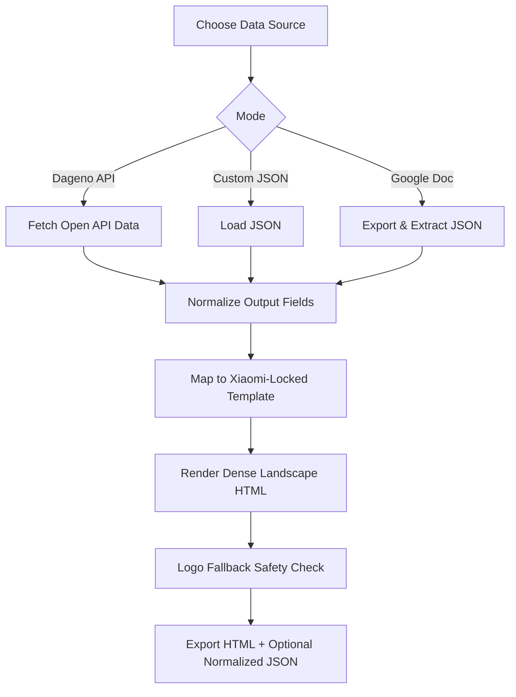

# Brand AI Performance Check


Stable, data-dense, single-visual **English HTML** reporting skill for GEO brand diagnostics.

## Why this repo

- Fixed high-quality dense template (Xiaomi-locked style)
- API-first data mapping from Dageno Open API
- Custom data mode via JSON or public Google Doc
- Showcase-ready assets for portfolio/demo

## Case Showcase

| Product | Visual | HTML Sample |
|---|---|---|
| LaserChina |  | [LaserChina.html](examples/showcase/html/LaserChina.html) |
| Producthunt |  | [Producthunt.html](examples/showcase/html/Producthunt.html) |
| Trip |  | [Trip.html](examples/showcase/html/Trip.html) |
| Ulike |  | [Ulike.html](examples/showcase/html/Ulike.html) |
| Xiaomi |  | [Xiaomi.html](examples/showcase/html/Xiaomi.html) |
| eSignGlobal |  | [eSignGlobal.html](examples/showcase/html/eSignGlobal.html) |

## Logic Flow



## Directory Structure

```text
.
├── README.md
├── docs/
│   ├── WORKFLOW.md
│   ├── OUTPUT_SCHEMA.md
│   └── TEMPLATE_RULES.md
├── skill/
│   ├── SKILL.md
│   ├── agents/openai.yaml
│   ├── references/required-fields.md
│   └── scripts/generate_report.py
└── examples/
    ├── custom_input.sample.json
    ├── output/
    └── showcase/
        ├── cover.jpg
        ├── images/
        └── html/
```

## Dageno API Key

Set API key:

```bash
export DAGENO_API_KEY="<YOUR_DAGENO_API_KEY>"
```

Need to register first?
- [Get API access at Dageno AI](https://dageno.ai/?utm_source=github&utm_medium=social&utm_campaign=official)

Header:
- `x-api-key: <YOUR_DAGENO_API_KEY>`

## Usage

### A) Dageno API mode

```bash
python3 skill/scripts/generate_report.py \
  --source dageno-api \
  --api-key "$DAGENO_API_KEY" \
  --start-at 2026-03-01 \
  --end-at 2026-04-15 \
  --output examples/output/report_api.html \
  --dump-normalized examples/output/report_api.normalized.json
```

### B) Custom JSON mode

```bash
python3 skill/scripts/generate_report.py \
  --source custom \
  --custom-json examples/custom_input.sample.json \
  --output examples/output/report_custom.html
```

### C) Google Doc mode

```bash
python3 skill/scripts/generate_report.py \
  --source custom \
  --google-doc-url "https://docs.google.com/document/d/<DOC_ID>/edit" \
  --output examples/output/report_doc.html
```

## Output Field Contract

Core normalized blocks:

- `brand`
- `headline`
- `overview`
- `kpis`
- `metrics`
- `platform_compare[]`
- `topics[]`
- `high_value_prompts[]`
- `existing_strengths[]`
- `missing_trust_assets[]`
- `sentiment`
- `top_citing_domains[]`
- `competitors[]`

Full details:
- [docs/OUTPUT_SCHEMA.md](docs/OUTPUT_SCHEMA.md)

## Necessary Elements (Quality Gates)

- Template style must stay Xiaomi-locked
- Core Diagnosis / KEY INSIGHT must exist
- Brand AI Performance Check footer block must exist
- Top Citing Domains ⭐ must exist
- Brand logo and competitor logos must render with fallback
- Keep dense layout, no large blank space, no overlap

See full rules:
- [docs/TEMPLATE_RULES.md](docs/TEMPLATE_RULES.md)
- [docs/WORKFLOW.md](docs/WORKFLOW.md)
