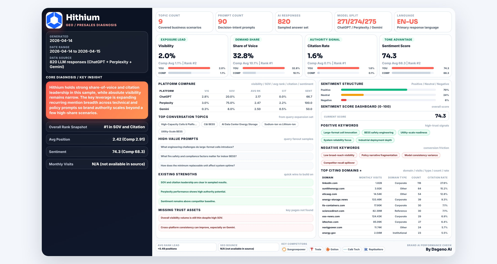

# Brand AI Performance Check

Generate a compact, data-dense, single-visual **English HTML** report for social sharing.

## What this repo provides

- A reusable skill: `Brand AI Performance Check`
- One generator script that supports two input modes:
1. **Dageno Open API** (recommended)
2. **User-provided data** via JSON file or public Google Doc link
- A fixed dense-landscape template pipeline (stable format)

## Case Showcase

The following examples are bundled directly in this repository.

| Product | Visual (from `report-en.zip`) | HTML Sample (from `report-HTML.zip`) |
|---|---|---|
| EasyLaTeX |  | [EasyLaTeX.html](examples/showcase/html/EasyLaTeX.html) |
| Hithium |  | [Hithium.html](examples/showcase/html/Hithium.html) |
| LaserChina |  | [LaserChina.html](examples/showcase/html/LaserChina.html) |
| Mileseey Golf |  | [Mileseey Golf.html](examples/showcase/html/Mileseey%20Golf.html) |
| Producthunt |  | [Producthunt.html](examples/showcase/html/Producthunt.html) |
| Trip |  | [Trip.html](examples/showcase/html/Trip.html) |
| Ulike |  | [Ulike.html](examples/showcase/html/Ulike.html) |
| Xiaomi |  | [Xiaomi.html](examples/showcase/html/Xiaomi.html) |
| eSignGlobal |  | [eSignGlobal.html](examples/showcase/html/eSignGlobal.html) |

## Skill location

- `skill/SKILL.md`
- `skill/agents/openai.yaml`
- `skill/scripts/generate_report.py`

## Dageno API setup

Set your API key as environment variable (recommended):

```bash
export DAGENO_API_KEY="<YOUR_DAGENO_API_KEY>"
```

Header used by API:
- `x-api-key: <YOUR_DAGENO_API_KEY>`

Need an API key first?
- Register at [dageno.ai](https://dageno.ai/?utm_source=github&utm_medium=social&utm_campaign=official)

Official API docs:
- [Dageno Open API Docs](https://open-api-docs.dageno.ai/)

## API endpoints used by this generator

- `GET /v1/open-api/brand`
- `GET /v1/open-api/topics`
- `GET /v1/open-api/prompts`
- `GET /v1/open-api/citations/domains`
- `POST /v1/open-api/geo/analysis`
- `GET /v1/brand/favicons?domain=...` (logo rendering)

## Usage

### Option A: Use Dageno API data

```bash
python3 skill/scripts/generate_report.py \
  --source dageno-api \
  --api-key "$DAGENO_API_KEY" \
  --start-at 2026-03-01 \
  --end-at 2026-04-15 \
  --output examples/output/report_api.html \
  --dump-normalized examples/output/report_api.normalized.json
```

### Option B1: Use your own JSON data

```bash
python3 skill/scripts/generate_report.py \
  --source custom \
  --custom-json examples/custom_input.sample.json \
  --output examples/output/report_custom.html
```

### Option B2: Use public Google Doc link containing JSON

```bash
python3 skill/scripts/generate_report.py \
  --source custom \
  --google-doc-url "https://docs.google.com/document/d/<DOC_ID>/edit" \
  --output examples/output/report_doc.html
```

## Required fields for custom data

See:
- `skill/references/required-fields.md`
- `examples/custom_input.sample.json`

## Notes on quality and layout

- Template quality is locked to the dense landscape frame in `examples/showcase/html/Xiaomi.html`.
- Keep structure and spacing stable. Replace data only, do not redesign layout.
- Data priority rule:
1. Use Dageno API values whenever available.
2. If missing, fallback to generated narrative text (for example `Core Diagnosis`).
- Core blocks must always be preserved:
1. `Core Diagnosis / KEY INSIGHT`
2. `Brand AI Performance Check`
3. `Top Citing Domains ⭐`
- Logo rules:
1. Brand logo must render in top-left.
2. Competitor logos must render from favicon/domain source with safe fallback.

## Showcase path

- `examples/showcase/images/`
- `examples/showcase/html/`
