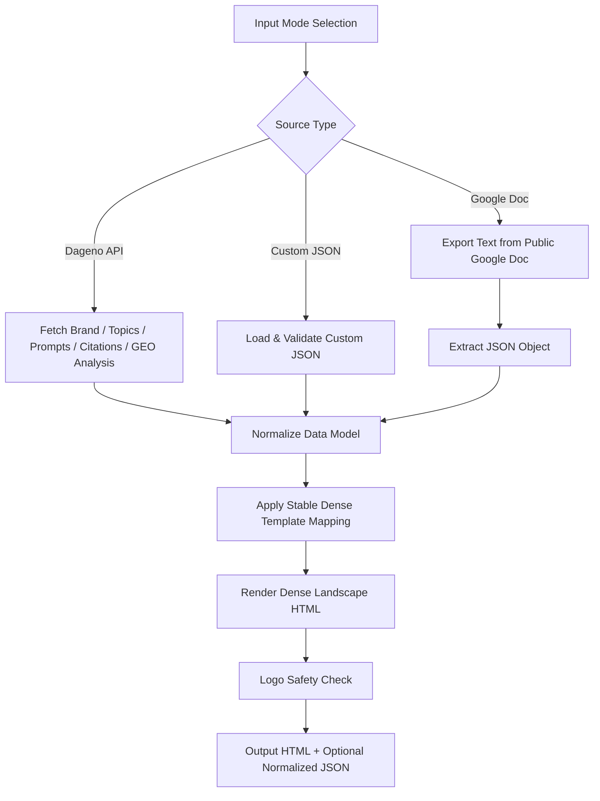

# Workflow

## End-to-End Pipeline

## Data Priority Rule

1. Use Dageno API fields whenever available.
2. If critical fields are missing, fallback to generated narrative text (for example Core Diagnosis).
3. Never break template layout to fit missing data.

## Language Rule

- Output report language must be English.
